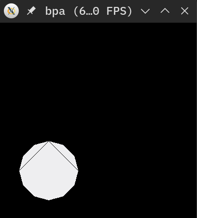
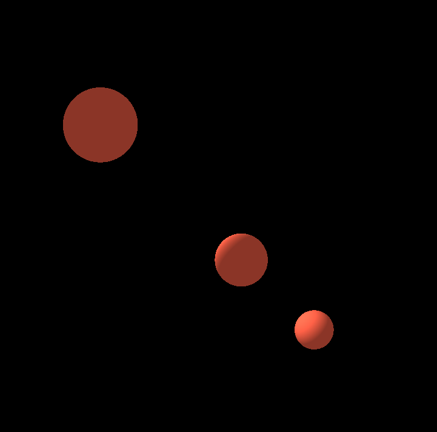
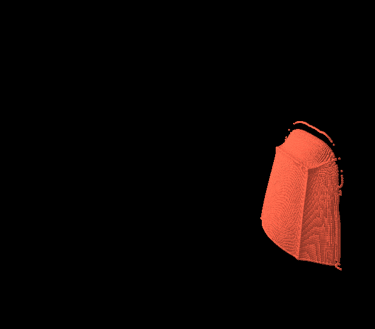

# Ti-SPH

This is my graduation project

## 1. Project structure

- core: the taichi code that compute the result.
- render: render the result from the coe
- data: the core input

## 2. The sph method

### 2.1 the wcsph

### 2.1 The boundary handler

## 3. Render

### 3.1 Ball pivoting algorithm

Using the bpa algorithm to render the points.

> This example render the points in a circle.



To run this example.

```shell
python ./render/bpa/d2.py
```

## 4.gui

There are two different ways.

- `ti.GUI`: render the 2D points
- `ti.ggui`: render the 2D and 3D points

A demo render three points with ggui.



A 3d demo running with ggui

